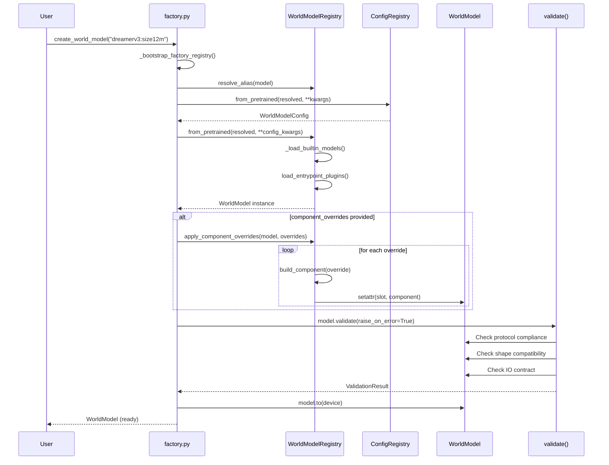

# Component Lifecycle

This diagram shows the flow of `create_world_model()` from user call
through component resolution, validation, and return.

## Component Slots

| Slot | Protocol | Method |
|------|----------|--------|
| `observation_encoder` | `ObservationEncoder` | `encode()` |
| `action_conditioner` | `ActionConditioner` | `condition()` |
| `dynamics_model` | `DynamicsModel` | `transition()` |
| `decoder_module` | `Decoder` | `decode()` |
| `rollout_executor` | `RolloutExecutor` | `rollout_open_loop()` |

## Override Resolution Order

1. String id - resolved through component registry
2. Class - instantiated with `(model)` or `()` signature
3. Callable - invoked as factory function with `(config)`
4. Instance - used directly
