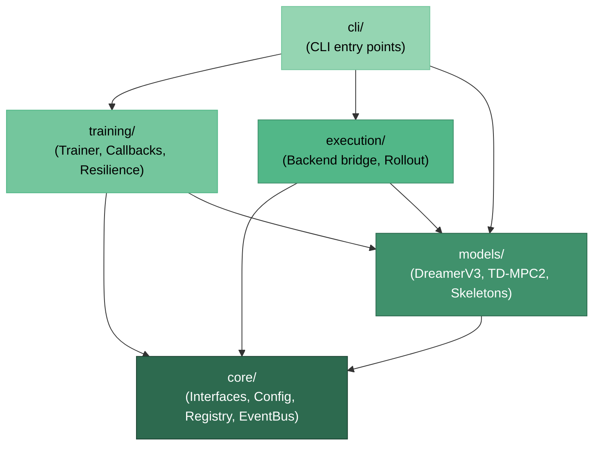

# Module Dependency Graph

WorldFlux is organized into 5 layers with strict dependency direction.
Each layer may depend on layers below it but never above.

## Layer Responsibilities

| Layer | Package | Responsibility |
|-------|---------|----------------|
| 5 | `cli/` | User-facing CLI commands, terminal output |
| 4 | `training/` | Trainer loop, callbacks, resilience, data loading |
| 3 | `execution/` | Backend bridge, rollout execution, planning |
| 2 | `models/` | Model implementations (DreamerV3, TD-MPC2, etc.) |
| 1 | `core/` | Interfaces, config, registry, events, state, batch |

## Key Rules

- `core/` must never import from `models/`, `training/`, or `cli/`.
- `models/` implements `core/` contracts but must not import `training/`.
- `training/` consumes model contracts through `core/` interfaces.
- Cross-layer lazy imports are acceptable for optional functionality.
