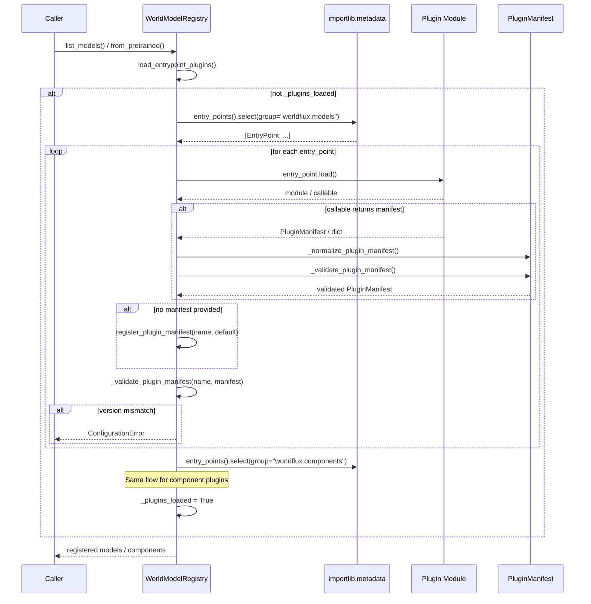

# Plugin Loading Sequence

External plugins register model families and components through Python
entry points. This diagram shows the discovery and registration flow.

## Entry Point Groups

| Group | Purpose | Example |
|-------|---------|---------|
| `worldflux.models` | Register model families | `my_model = my_pkg:register` |
| `worldflux.components` | Register reusable components | `my_encoder = my_pkg:register` |

## Manifest Validation

Plugins must declare compatibility via `PluginManifest`:

- `plugin_api_version`: Must be non-empty (currently `"0.x-experimental"`)
- `worldflux_version_range`: PEP 440 specifier checked against runtime
- `experimental`: Must be `True` in current API phase
- `capabilities`: Tuple of capability strings

Invalid manifests raise `ConfigurationError` at load time.
