# Training Loop Flow

Internal flow of `Trainer.train()` showing the batch-level training
loop, gradient accumulation, and callback/event integration.

```mermaid
flowchart TD
    START([train called]) --> RESUME{resume_from?}
    RESUME -->|yes| LOAD[load_checkpoint]
    RESUME -->|no| INIT
    LOAD --> INIT[Initialize state, log config]

    INIT --> CB_BEGIN[callbacks.on_train_begin]
    CB_BEGIN --> EVT_BEGIN["publish(train.begin)"]
    EVT_BEGIN --> LOOP{step < total_steps?}

    LOOP -->|no| FINISH
    LOOP -->|yes| EVT_STEP_BEGIN["publish(step.begin)"]
    EVT_STEP_BEGIN --> FETCH[_next_batch - sample from provider]

    FETCH --> ZERO{accumulation == 0?}
    ZERO -->|yes| ZERO_GRAD[optimizer.zero_grad]
    ZERO -->|no| SKIP_ZERO[skip zero_grad]
    ZERO_GRAD --> FWD
    SKIP_ZERO --> FWD

    FWD[Forward pass: model.loss] --> NAN_CHECK{NaN/Inf in loss?}
    NAN_CHECK -->|yes| NAN_ERR[TrainingError - NaN detected]
    NAN_CHECK -->|no| EVT_LOSS["publish(loss.computed)"]

    EVT_LOSS --> BACKWARD[loss.backward]
    BACKWARD --> EVT_BWD["publish(backward.complete)"]

    EVT_BWD --> ACCUM{accumulation complete?}
    ACCUM -->|no| INC[increment accumulation counter]
    ACCUM -->|yes| GRAD_CHECK[Check gradients for NaN/Inf]

    GRAD_CHECK --> CLIP{grad_clip > 0?}
    CLIP -->|yes| CLIP_GRAD[clip_grad_norm_]
    CLIP -->|no| STEP
    CLIP_GRAD --> EVT_CLIP["publish(gradients.clipped)"]
    EVT_CLIP --> STEP

    STEP[optimizer.step] --> EVT_OPT["publish(optimizer.stepped)"]
    EVT_OPT --> SCHED{scheduler?}
    SCHED -->|yes| SCHED_STEP[scheduler.step]
    SCHED -->|no| UPDATE
    SCHED_STEP --> UPDATE

    INC --> UPDATE[Update state metrics]
    UPDATE --> INC_STEP[global_step += 1]
    INC_STEP --> CB_STEP[callbacks.on_step_end]
    CB_STEP --> EVT_STEP_END["publish(step.end)"]
    EVT_STEP_END --> STOP{should_stop?}

    STOP -->|yes| FINISH
    STOP -->|no| LOOP

    FINISH[callbacks.on_train_end] --> EVT_END["publish(train.end)"]
    EVT_END --> SAVE[save_checkpoint - final]
    SAVE --> MANIFEST[write_run_manifest]
    MANIFEST --> QUALITY{auto_quality_check?}
    QUALITY -->|yes| QC[quality_check SMOKE]
    QUALITY -->|no| RETURN
    QC --> RETURN([return model])

    NAN_ERR --> FINISH

    style START fill:#2d6a4f,color:#fff
    style RETURN fill:#2d6a4f,color:#fff
    style NAN_ERR fill:#d32f2f,color:#fff
```

## Key Integration Points

| Point | Callback Hook | Event Type |
|-------|---------------|------------|
| Training start | `on_train_begin` | `train.begin` |
| Before each step | `on_step_begin` | `step.begin` |
| Loss computed | - | `loss.computed` |
| Backward complete | - | `backward.complete` |
| Gradients clipped | - | `gradients.clipped` |
| Optimizer stepped | - | `optimizer.stepped` |
| After each step | `on_step_end` | `step.end` |
| Training end | `on_train_end` | `train.end` |
| Error during step | - | `training.error` |
