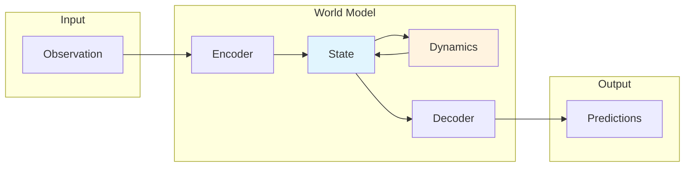

# Core Concepts

Understanding WorldFlux's architecture and key components.

## What is a World Model?

A **world model** is a neural network that learns to predict how an environment evolves. It enables:

- **Planning**: Predict outcomes without real environment interaction
- **Imagination**: Generate synthetic experience for training
- **Efficient Learning**: Learn from fewer real interactions

## Architecture Overview



## Key Components

### Encoder

Compresses high-dimensional observations into compact latent representations.

```python
state = model.encode(obs)  # [B, *obs_shape] -> State
```

### State

The core representation that captures environment state:

```python
# DreamerV3
state.tensors["deter"]   # History/context information
state.tensors["stoch"]   # Uncertainty (DreamerV3 only)

# TD-MPC2
state.tensors["latent"]  # SimNorm embedding
```

### Dynamics Model

Predicts next latent state given current state and action:

```python
# Prior (imagination, no observation)
next_state = model.transition(state, action)

# Posterior (with observation)
next_state = model.update(state, action, obs)
```

### Decoder

Reconstructs observations and predicts rewards from latent states:

```python
output = model.decode(state)
preds = output.preds
# preds["obs"], preds["reward"], preds.get("continue")
```

## Imagination Rollouts

The key feature: multi-step prediction without environment:

```python
trajectory = model.rollout(initial_state, actions)
# trajectory.states    - List of predicted States
# trajectory.rewards   - [T, B] predicted rewards (optional)
# trajectory.continues - [T, B] episode continuation probs (optional)
```

## Model Types

### DreamerV3

- **Input**: Images or state vectors
- **Architecture**: RSSM (Recurrent State Space Model)
- **Latent Space**: Categorical (discrete)
- **Decoder**: Reconstructs observations
- **Best For**: Visual tasks (Atari)

### TD-MPC2

- **Input**: State vectors
- **Architecture**: Implicit MLP
- **Latent Space**: SimNorm (continuous)
- **Decoder**: None (implicit model)
- **Best For**: Continuous control (MuJoCo)

### JEPA

- **Input**: Images or state vectors
- **Architecture**: Context/target prediction in latent space
- **Latent Space**: Deterministic embeddings
- **Decoder**: Optional (non-generative by default)
- **Best For**: Representation learning and masked prediction

### Token World Models

- **Input**: Discrete tokens (e.g., VQ-VAE codes)
- **Architecture**: Transformer sequence model
- **Latent Space**: Token embeddings
- **Decoder**: Token logits or reconstructed observations
- **Best For**: Autoregressive/video token modeling

### Diffusion World Models

- **Input**: Continuous state vectors or latents
- **Architecture**: Denoising diffusion dynamics
- **Latent Space**: Gaussian noise schedule
- **Decoder**: Iterative denoising
- **Best For**: Generative rollout and stochastic prediction

## Training Loop

World models learn from trajectories collected from the environment:

```
1. Collect trajectories (obs, actions, rewards, dones)
2. Store in ReplayBuffer
3. Sample batches
4. Compute loss (reconstruction + KL + reward prediction)
5. Update model
6. Repeat
```

## Next Steps

- [Train Your First Model](../tutorials/train-first-model.md)
- [DreamerV3 vs TD-MPC2](../tutorials/dreamer-vs-tdmpc2.md)
