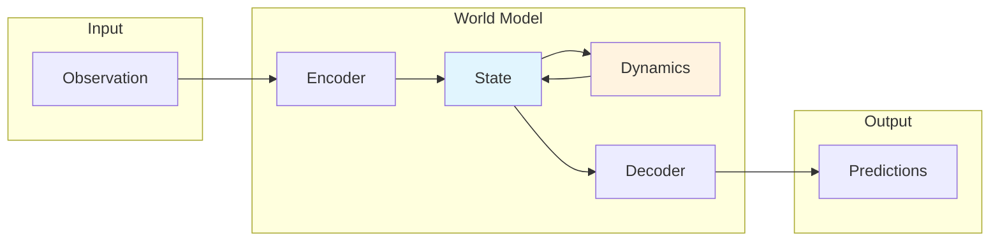

# Core Concepts

Understanding WorldFlux architecture and key components.

!!! warning "Reference / Deprecated onboarding page"
    This page is retained for backward compatibility and deep background reading.
    For the supported onboarding path, use [Installation](installation.md) and
    [Quick Start](quickstart.md).

## What Is a World Model?

A **world model** is a neural network that learns to predict how an environment evolves. It enables:

- **Planning**: Predict outcomes without direct environment interaction
- **Imagination**: Generate synthetic experience for training
- **Efficient Learning**: Learn from fewer real interactions

## Architecture Overview



## Key Components

### Encoder

Compresses high-dimensional observations into compact latent representations.

```python
state = model.encode(obs)  # [B, *obs_shape] -> State
```

### State

Core representation that captures environment state:

```python
# DreamerV3
state.tensors["deter"]
state.tensors["stoch"]

# TD-MPC2
state.tensors["latent"]
```

### Dynamics Model

Predicts next latent state from current state and action:

```python
next_state = model.transition(state, action)
next_state = model.update(state, action, obs)
```

### Decoder

Reconstructs observations and predicts rewards from latent states:

```python
output = model.decode(state)
preds = output.preds
```

## Imagination Rollouts

```python
trajectory = model.rollout(initial_state, actions)
# trajectory.states
# trajectory.rewards
# trajectory.continues
```

## Training Loop

World models learn from trajectories:

1. Collect trajectories (obs, actions, rewards, dones)
2. Store in `ReplayBuffer`
3. Sample batches
4. Compute losses
5. Update model
6. Repeat

## Next Steps

- [Installation](installation.md)
- [Quick Start](quickstart.md)
- [Training API Guide](../api/training.md)
