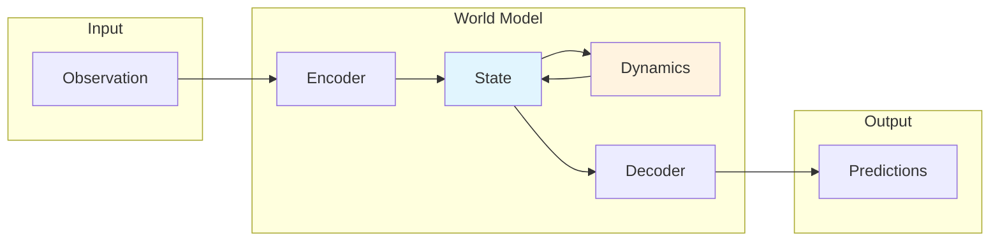

# WorldFlux

<div align="center">

</div>

**Unified Interface for World Models in Reinforcement Learning**

*One API. Multiple Architectures. Infinite Imagination.*

[](https://colab.research.google.com/github/worldflux/WorldFlux/blob/main/examples/worldflux_quickstart.ipynb)
[](https://github.com/worldflux/WorldFlux)
[](https://opensource.org/licenses/Apache-2.0)

---

WorldFlux provides a unified Python interface for world models used in reinforcement learning.

## Features

- **Unified API**: Common interface across model families
- **Simple Usage**: One-liner model creation with `create_world_model()`
- **Training Infrastructure**: Training loop with callbacks, checkpointing, and logging
- **Type Safe**: Full type annotations and mypy compatibility

## Quick Start

```bash
uv sync --extra dev
uv run python examples/quickstart_cpu_success.py --quick
```

Official CPU-success docs: [CPU Success Path](getting-started/cpu-success.md)

### API Glimpse

```python
from worldflux import create_world_model
import torch

model = create_world_model(
    "dreamerv3:size12m",
    obs_shape=(3, 64, 64),
    action_dim=4,
)

obs = torch.randn(1, 3, 64, 64)
state = model.encode(obs)

actions = torch.randn(15, 1, 4)
trajectory = model.rollout(state, actions)

print(trajectory.rewards.shape)
```

## Available Models

| Family | Presets |
|-------|---------|
| DreamerV3 | `size12m`, `size25m`, `size50m`, `size100m`, `size200m` |
| TD-MPC2 | `5m`, `19m`, `48m`, `317m` |
| JEPA | `base` |
| Token | `base` |
| Diffusion | `base` |

## Documentation

<div class="grid cards" markdown>

-   **Getting Started**

    ---

    Minimal onboarding for installation and first execution.

    [:octicons-arrow-right-24: Installation](getting-started/installation.md)

    [:octicons-arrow-right-24: Quick Start](getting-started/quickstart.md)

    [:octicons-arrow-right-24: CPU Success Path](getting-started/cpu-success.md)

-   **API Reference**

    ---

    Implementation-aligned API contracts and autogenerated symbols.

    [:octicons-arrow-right-24: Factory Functions](api/factory.md)

    [:octicons-arrow-right-24: WorldModel Base Class](api/protocol.md)

    [:octicons-arrow-right-24: Training](api/training.md)

-   **Reference**

    ---

    Operational documentation and project quality checks.

    [:octicons-arrow-right-24: Benchmarks](reference/benchmarks.md)

    [:octicons-arrow-right-24: Unified Comparison](reference/unified-comparison.md)

    [:octicons-arrow-right-24: Documentation Stack](reference/docs-stack.md)

    [:octicons-arrow-right-24: Release Checklist](reference/release-checklist.md)

    [:octicons-arrow-right-24: Publishing](reference/publishing.md)

    [:octicons-arrow-right-24: Troubleshooting](reference/troubleshooting.md)

    [:octicons-arrow-right-24: WASR Metrics](reference/wasr.md)

</div>

## Architecture



## Installation

```bash
uv tool install worldflux
worldflux init my-world-model
```

## Try It Now

The fastest way to get started is our [interactive Colab notebook](https://colab.research.google.com/github/worldflux/WorldFlux/blob/main/examples/worldflux_quickstart.ipynb).

## Contributing

Contributions are welcome. See our [Contributing Guide](https://github.com/worldflux/WorldFlux/blob/main/CONTRIBUTING.md).

## License

Apache License 2.0 - see [LICENSE](https://github.com/worldflux/WorldFlux/blob/main/LICENSE) and
[NOTICE](https://github.com/worldflux/WorldFlux/blob/main/NOTICE) for details.
