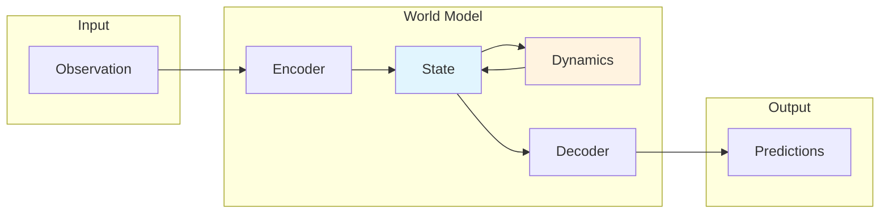

# WorldFlux

<div align="center">

</div>

**Unified Interface for World Models in Reinforcement Learning**

*One API. Multiple Architectures. Infinite Imagination.*

[](https://colab.research.google.com/github/worldflux/Worldflux/blob/main/examples/worldflux_quickstart.ipynb)
[](https://github.com/worldflux/Worldflux)
[](https://opensource.org/licenses/Apache-2.0)

---

WorldFlux provides a unified Python interface for world models used in reinforcement learning. Starting with efficient latent-space models (DreamerV3, TD-MPC2), with plans to support diverse architectures including autoregressive and diffusion-based world models.

## Features

- **Unified API**: Common interface across DreamerV3, TD-MPC2, and more
- **Simple Usage**: One-liner model creation with `create_world_model()`
- **Training Infrastructure**: Complete training loop with callbacks, checkpointing, and logging
- **Type Safe**: Full type annotations and mypy compatibility

## Quick Start

```python
from worldflux import create_world_model
import torch

# Create a world model
model = create_world_model(
    "dreamerv3:size12m",
    obs_shape=(3, 64, 64),
    action_dim=4,
)

# Encode observation to latent state
obs = torch.randn(1, 3, 64, 64)
state = model.encode(obs)

# Imagine 15 steps into the future
actions = torch.randn(15, 1, 4)
trajectory = model.rollout(state, actions)

print(f"Predicted rewards: {trajectory.rewards.shape}")  # [15, 1, 1]
```

## Available Models

| Model | Best For | Presets |
|-------|----------|---------|
| **DreamerV3** | Images, Atari | `size12m`, `size25m`, `size50m`, `size100m`, `size200m` |
| **TD-MPC2** | State vectors, MuJoCo | `5m`, `19m`, `48m`, `317m` |
| **JEPA** | Representation prediction | `base` |
| **Token** | Discrete token dynamics | `base` |
| **Diffusion** | Stochastic dynamics | `base` |

## Documentation

<div class="grid cards" markdown>

-   **Getting Started**

    ---

    Install WorldFlux and learn the basics.

    [:octicons-arrow-right-24: Installation](getting-started/installation.md)

    [:octicons-arrow-right-24: Quick Start](getting-started/quickstart.md)

    [:octicons-arrow-right-24: Core Concepts](getting-started/concepts.md)

-   **Tutorials**

    ---

    Step-by-step guides for common tasks.

    [:octicons-arrow-right-24: Train Your First Model](tutorials/train-first-model.md)

    [:octicons-arrow-right-24: DreamerV3 vs TD-MPC2](tutorials/dreamer-vs-tdmpc2.md)

-   **Reproduction**

    ---

    Reproduce results with bundled datasets.

    [:octicons-arrow-right-24: Reproduce Dreamer/TD-MPC2](tutorials/reproduce-dreamer-tdmpc2.md)

-   **API Reference**

    ---

    Complete API documentation.

    [:octicons-arrow-right-24: Factory Functions](api/factory.md)

    [:octicons-arrow-right-24: WorldModel Base Class](api/protocol.md)

    [:octicons-arrow-right-24: Training](api/training.md)

-   **Reference**

    ---

    Release and quality guidance.

    [:octicons-arrow-right-24: OSS Quality Gates](reference/quality-gates.md)

</div>

## Architecture



## Installation

```bash
git clone https://github.com/worldflux/Worldflux.git
cd worldflux
uv sync --extra training
```

## Try It Now

The fastest way to get started is our [interactive Colab notebook](https://colab.research.google.com/github/worldflux/Worldflux/blob/main/examples/worldflux_quickstart.ipynb).

## Contributing

Contributions are welcome! See our [Contributing Guide](https://github.com/worldflux/Worldflux/blob/main/CONTRIBUTING.md).

## License

Apache License 2.0 - see [LICENSE](https://github.com/worldflux/Worldflux/blob/main/LICENSE) and
[NOTICE](https://github.com/worldflux/Worldflux/blob/main/NOTICE) for details.
